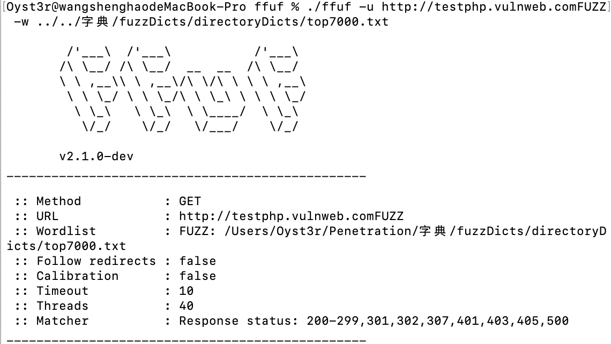

相信看完上节内容的小伙伴会感觉那么写出来的代码是一坨答辩，十分欠妥的，这节就来在此基础上继续优化一下

## 概念

给一张图片，看一看大概的用法，具体可以看下面代码写的例子


## 使用Queue的多线程爬虫

这个Queue模块就是为了解决线程间通信的问题，而且Python中的`Queue`模块中提供了同步的、线程安全的队列类，包括FIFO（先入先出）队列 Queue、LIFO（后入先出）队列 LifoQueue和优先级队列 PriorityQueue

用直白点的话说就是可以把这个Queue看成一个容器，诶呀其实就像栈一样，把它看成一个暂时存放数据的容器，而且这个容器会封装了很多功能，就比如说要是只开四个线程，那就是用一个少一个，而这个就可以轮回开，有点类似于线程池那意思了，然后的话这个功能本身就是很安全的，不需要加锁，是个线程安全的操作，下面给出我的实现代码

```
import craw
import threading
import time
import queue


def queue_craw(url_queue):
    while True:
            url = url_queue.get()
            craw.crawler(url)
            if url_queue.empty():
                print("here")
                break


if __name__ == "__main__":
    url_queue = queue.Queue()
    threads = []
    start = time.time()
    for url in craw.urls:
        url_queue.put(url)

    for i in range(3):
        t = threading.Thread(target=queue_craw,args=(url_queue,),name=f'craw{i}')
        t.start()
        threads.append(t)

    for thread in threads:
        thread.join()

    end =time.time()
    print('url_queue花费时间',end-start)
```

这其实也算是一个生产者与消费者的模型，可以看作url在不断的生产，然后解析url就算是在不断的消费，当然在后面也可以继续写比如把得到的数据写入文本文件，这里就不再阐述，它就和一条链子一样串下去就行，这里主要想说明的问题就是它很自动化，会正确的让三个线程分配这23个页面，就是更加灵活了，不会存在像上节写的那样一下创建23个线程的呆板问题


同样的这个结果所展现的速度也是相当快的，其实就相当于是三个线程一直去接受url去解析




当然后面也会再说一个线程池的技术，那个就更方便了，实际开发中也是经常选择用线程池的，敬请期待吧！！！