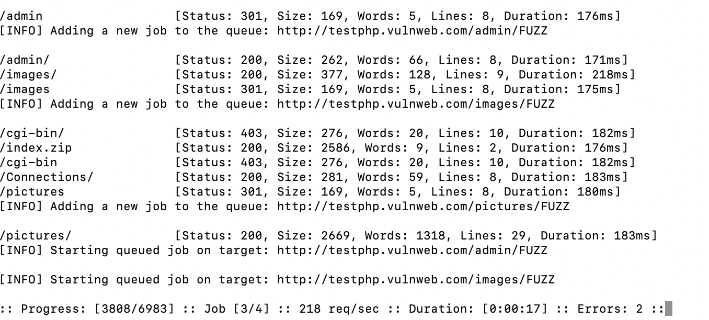

## 前言

RMI（Remote Method Invocation），即远程方法调用。能够让在某个 Java 虚拟机上的对象像调用本地对象一样调用另一个 Java 虚拟机中的对象上的方法。这和 C 语言中的 RPC 是很像的，RPC 是打包和传送数据结构，而 Java 中通常传递一个完整的对象-->这个过程就是用序列化、反序列化去实现的，有反序列化就可能出现漏洞！调试 RMI 的整个过程，剖析一下哪里可能会触发漏洞。

## 准备工作

1.IDEA 配置 JDK 8u65（选择一个低版本的 JDK，高版本 JDK 针对 RMI 漏洞做出修复）。

2.新建两个项目，一个作为服务端，一个作为客户端。

服务端代码如下-->

IRemoteObject 接口：

```java
import java.rmi.Remote;
import java.rmi.RemoteException;

public interface IRemoteObject extends Remote {
    public String sayHello(String name) throws RemoteException;
}
```

IRemoteObject 接口的实现类 HelloRemoteObject：

```java
import java.rmi.RemoteException;
import java.rmi.server.UnicastRemoteObject;

public class HelloRemoteObject extends UnicastRemoteObject implements IRemoteObject {

    public HelloRemoteObject() throws RemoteException {
        super();
    }

    @Override
    public String sayHello(String name) throws RemoteException {
        return "Hello " + name;
    }
}
```

主函数 RMIServer：

```java
import java.rmi.registry.LocateRegistry;
import java.rmi.registry.Registry;

public class RMIServer {
    public static void main(String[] args) throws Exception {
        HelloRemoteObject helloRemoteObject = new HelloRemoteObject();
        Registry registry = LocateRegistry.createRegistry(1099);
        registry.bind("helloRemoteObject", helloRemoteObject);
        System.out.println("RMI Server is ready...");
    }
}
```

客户端代码如下-->

和服务端一样的 IRemoteObject 接口：

```java
import java.rmi.Remote;
import java.rmi.RemoteException;

public interface IRemoteObject extends Remote {
    public String sayHello(String name) throws RemoteException;
}
```

主函数 RMIClient：

```java
import java.rmi.registry.LocateRegistry;
import java.rmi.registry.Registry;

public class RMIClient {
    public static void main(String[] args) throws Exception {
        Registry registry = LocateRegistry.getRegistry("192.168.xxx.xxx", 1099);
        IRemoteObject helloRemoteObject = (IRemoteObject)registry.lookup("helloRemoteObject");
        System.out.println(helloRemoteObject.sayHello("xxx"));
    }
}
```

成功运行后，输出结果如下-->

```
Hello xxx
```

## 实现过程

RMI 实现过程还是蛮复杂，做了一张图，如下-->


大致分了 12 点，接下来与代码处对应一下。

```
1、2、3-->HelloRemoteObject helloRemoteObject = new HelloRemoteObject();
4、5、6-->Registry registry = LocateRegistry.createRegistry(1099);
7、8-->registry.bind("helloRemoteObject", helloRemoteObject);
9-->Registry registry = LocateRegistry.getRegistry("192.168.xxx.xxx", 1099);
10、11-->IRemoteObject helloRemoteObject = (IRemoteObject)registry.lookup("helloRemoteObject");
12-->helloRemoteObject.sayHello("xxx");
```

可能会好奇 😯Stubs 与 Skeletons 是什么东西？首先明白这俩是成对出现的，一个叫客户端存根（Stubs），一个叫服务端骨架（Skeletons），是两个抽象的概念，其次要知道这俩是作为动态代理去解决通信问题（动态代理设计之初就是为了不修改原始代码的情况下增加对象的功能，这里所增加的功能即是远程通信），这么描述也不太准确，因为 Registry 端 Stubs 与 Skeletons 的创建是实例化出的（可能是要增加的功能太多了，不单单是要实现远程通信），参考图中第 4 点。

接下来调试代码，剖析一下其中哪些是可以被漏洞利用的。

## 远程对象创建（1、2、3）

`HelloRemoteObject helloRemoteObject = new HelloRemoteObject();`这一行代码内部主要实现了以下三点：

1. 创建本地存根的代理对象 ServerStubs，供客户端使用
2. 启动 socket
3. 将 Target 最终注册到 ObjectTable

开始调试，HelloRemoteObject 类是自己写的实现类，它的构造函数是没什么代码逻辑的，主要把聚焦点放在它父类 UnicastRemoteObject 的构造函数上，如下-->



它的关键函数是 exportObject 方法，顾名思义暴露对象，他去调用了重载 🔃 方法，如下-->


可以看到它在暴露对象之前去调用了`UnicastServerRef(port)`这个方法，这个方法要跟进去看的话就是调用了一个`LiveRef(port)`，这个方法中会初始化启动 socket 所必备的东西，但还没有真正启动 socket，可以看到调用完之后的端口仍是 0-->


之后一路跟到 UnicastServerRef 类的 exportObject 方法，至此开始创建 stub（ServerStubs），如下-->


跟进去 createProxy 方法看看


可以看出首先经过了一个 if 判断，但是这里没过，所以就走的`Proxy.newProxyInstance()`一套常规的动态代理创建流程。创建完 stub 回到 exportObject 方法，可以发现再次经过了一个 if 判断，这次还是没过，没有进去。（对这两个 if 判断留个印象）


之后就把所有东西放进了 Target 中，就相当于做了一次赋值，没啥好说的，接着调用了`ref.exportObject(target);`，此时这个 ref 是之前提到的 LiveRef，之前只是初始化启动 socket 所必备的东西，这下调用了`exportObject(target)`方法毫无疑问就是要启动 socket 了！

一路调用到 TCPTransport 类的 exportObject 方法的 listen 方法-->


listen 方法中创建 AcceptLoop 线程接收客户端的连接，每一个 socket 连接创建一个 ConnectionHandler 处理，这也是 BIO 处理客户端连接的基本套路，之后就等待连接了，执行后续的方法了。

最后就是将 Target 实例注册到 ObjectTable 对象中，如下-->


之后就能通过实例在 ObjectTable 中查找到对应的 Target 了。

回到 UnicastServerRef 类的 exportObject 方法，此时 socket 已经启动了，可以看到实际上 stub 的 LiveRef 和 UnicastServerRef 的 LiveRef 是同一个东西，LiveRef 一样才能通信！-->


stub 是之后要传给客户端的，所以客户端和服务端才可以远程通信！至此，远程对象创建完成。

总结：三点任务都完成了，回顾整个过程，`HelloRemoteObject helloRemoteObject = new HelloRemoteObject();`这一行代码的实现中是没有漏洞利用点的！

## 注册中心创建（4、5、6）

对应着的是这一行代码-->`Registry registry = LocateRegistry.createRegistry(1099);`，注册中心只是一个特殊的服务端，所以代码逻辑与上面远程对象创建几乎完全相同，只不过它的功能点较多，所以 Stubs 与 Skeletons 的创建是实例化具体类去实现的，而非动态代理去实现的（也就是上面强调过的两个 if）。

构造函数、初始化啥的就不啰嗦了，挑关键点跟一跟：


这和远程对象创建时候的`LiveRef(port)`一样，都是初始化启动 socket 所必备的东西，但没有真正启动 socket。接着进入到 setup 方法中，如下-->


可以看到还是去调用了 UnicastServerRef 类的 exportObject 方法，剩下的步骤和远程对象创建时候的基本一样了。其中不同的就是那两个 if 都能进去了：

第一个 if-->


跟进去 createStub 方法


可以看到是直接 forName 去加载了`sun.rmi.registry.RegistryImpl_Stub`类对象，之后 newInstance 去实例化它。

第二个 if-->


顾名思义，是一个创建 Skeletons 的方法，这也很好理解，由于注册中心的 Stubs 是去实例化类对象出来的，并非是动态代理创建的，功能肯定是变多的，不单单是实现远程通信，如下-->


相应的注册中心的 Skeletons 不能仅仅是一个`UnicastServerRef`，如下-->


相当于给`UnicastServerRef`加了一双翅膀。跟进去看看-->


跟进去 createSkeleton 方法


和前面 Stub 的创建类似，是 forName 加载了`sun.rmi.registry.RegistryImpl_Skel`类对象，之后 newInstance 去实例化它。最后也是启动 socket，这回的端口是固定 🧷 的 1099-->


可以看到它们的 LiveRef 是同一个东西，LiveRef 一样才能通信！

最后把 Target 注册到 ObjectTable 中，如下-->


至此，注册中心创建完成。可以看到与远程对象创建时候的逻辑几乎完全相同，主要实现了以下三点：

1. 实例化出 RegistryImpl_Stub 对象，但这里并不供客户端使用
2. 实例化出 RegistryImpl_Skel 对象，启动 socket
3. 将 Target 最终注册到 ObjectTable

总结：回顾整个过程，`Registry registry = LocateRegistry.createRegistry(1099);`这一行代码的实现也是没有漏洞利用点的。

## 服务注册（7、8）

当服务 helloRemoteObject 和 Registry 均已创建并发布后，之后需要将服务绑定到注册中心，很简单了，对应着的是这一行代码-->`registry.bind("helloRemoteObject", helloRemoteObject);`，跟进去调试一下：


就是将自定义好的服务名称和实例（注意这里只是 helloRemoteObject 实例，并不是一个 Target）保存到 HashMap 中即可。之后客户端在查找时可以通过 name 查找到实例，再通过实例在 ObjectTable 中查找到对应的 Target。

当然了这是 Server 端与 Registry 在同一端的情况（当然绝大部分情况是这样的），可以直接调用 Registry 的 bind 方法进行绑定，如果不在同一端，Server 端就要根据 Registry 的 host/port 等信息创建本地 RegistryImpl_Stub，然后调用其 bind 方法向 Registry 端使用 writeObject 写入 name 和生成的动态代理类...这块放后面吧，和下面获取 Registry、根据注册中心获取服务那一块代码是基本一样的。

总结：回顾这个过程，当 Server 端与 Registry 在同一端时，`registry.bind("helloRemoteObject", helloRemoteObject);`这一行代码的实现是没有漏洞利用点的。都这么说了，那当 Server 端与 Registry 不在同一端时，服务注册（即 blind）这里是有漏洞利用点的，是可以被攻击的！

## 获取 Registry（9）

接下来去看 RMIClient 端的代码，获取 Registry 端的代码如下是这一行：`Registry registry = LocateRegistry.getRegistry("192.168.xxx.xxx", 1099);`，跟一下代码如下-->


接着如下-->


可以看到又是熟悉的 LiveRef（端口是 1099），然后这次是直接调用了`Util.createProxy(xxx)`这个方法，跟进去看看-->


可以看到和前面 Server、Registry 端的创建是一样的，进去第一个 if 判断的位置会直接 forName 加载`sun.rmi.registry.RegistryImpl_Stub`类对象，之后 newInstance 去实例化它。之后一路 return 到最开始的位置。

可以发现获取 Registry 端这一部分的代码和注册中心创建中创建 Stub 的代码是一模一样的，相当于客户端是自写了一个 Stub，然后去进行后续通讯。

总结：回顾这个过程，`Registry registry = LocateRegistry.getRegistry("192.168.xxx.xxx", 1099);`这一行代码的实现是没有漏洞利用点的。

## 根据注册中心获取服务-上（10、11）

对应的是 Client 端这一行代码：`IRemoteObject helloRemoteObject = (IRemoteObject)registry.lookup("helloRemoteObject");`。先进行一些初始化的操作 newCall，之后直接将 var1 进行了 writeObject，如下-->


而 var1 是要查找的服务名称，也就是 helloRemoteObject，将一个名称进行了序列化传输，那么对应的 Registry 端一定有 readObject 方法去反序列化这个名称。

之后进入`super.ref.invoke(var2);`这一行代码，注意这里的 super.ref 是 UnicastRef 类，断点下在 UnicastRef 类的 invoke 方法即可继续调试（RegistryImpl_Stub 代码是反编译出的，下不了断点），如下-->


就不继续跟 executeCall 方法的具体逻辑了（就是一个去进行网络通信的方法，和 Registry 端的 Skeletons 进行网络通讯，传输这个序列化的服务名称，得到序列化的 ServerStubs），但可以看到它有一个处理异常的方法，里面有 readObject 方法，这是需要去关注的，如下-->


设计原本可能是为了出现异常可以反序列化这个对象获取更详细 🔎 的信息，但这里是可以被攻击的。回到 RegistryImpl_Stub 类中，再次发现了一个 readObject 方法，如下-->


毫无疑问了，图中的 var6 就是经 Registry 端查询后传回来的对象，也就是 ServerStubs，有 readObject 方法，所以这里也是可以被攻击的！

总结：回顾这个过程，`IRemoteObject helloRemoteObject = (IRemoteObject)registry.lookup("helloRemoteObject");`这一行代码的实现是有两个漏洞利用点，都属于 Registry 端攻击 Client 端。

Tips：传统观念中只有像 lookup 这种有返回值的方法才能被攻击，其实不然。为什么？答案已经给出了，就在第一处，第一处可以说只要调用了`super.ref.invoke(var2);`这行代码的地方都有可能被攻击，第二处相当于只是 lookup 这个方法独有的攻击点。比如：

RegistryImpl_Stub 类的 bind 方法-->


RegistryImpl_Stub 类的 rebind 方法-->


......

比较一下其实可以发现第一处 readObject 反序列化漏洞的利用难度要小于第二处，利用广度要大于第二处。

## 根据注册中心获取服务-下（10、11）

嗯对的，还是去分析根据注册中心获取服务，上面一栏的是客户端部分，这一栏是分析一下 Registry 端是如何做的。

在剖析注册中心创建部分的一栏，它最后启动了一个 listen 方法，就一直等着 Client 的请求，如下-->


现在请求（序列化的服务名称）来了，看看 listen 方法会怎么做？

跟到开新线程的地方，跟进去 AcceptLoop 方法-->


跟进去它 run 方法 executeAcceptLoop 方法-->


跟进去 executeAcceptLoop 方法中的 ConnectionHandler 方法-->


跟 ConnectionHandler 类的 run 方法中的 run0 方法-->


跟进去 run0 方法的 handleMessages 方法-->


顾名思义这里就是捕获请求（序列化的服务名称）的地方，再跟进去这里-->


可以看到 serviceCall 中就去拿到 ObjectTable 表中的内容-->


获取之前的绑定-->


之后拿到了 disp，disp 就是 Registry 端的 Skeletons-->


调用 disp 的 dispatch 方法如下-->


可以看到此时 disp 的类型就是一个 UnicastServerRef（很清晰了本质上还是 UnicastRef 和 UnicastServerRef 的通信），实际上就是调用了 UnicastServerRef 的 dispatch 方法，之后 dispatch 方法会调用到 oldDispatch 方法，如下-->


最后走到了 RegistryImpl_Skel 类的 dispatch 方法，如下-->


此时它四个参数的含义分别是 HelloRemoteObject 实例、请求（序列化的服务名称）、方法 ID、Hash 值。ID 是 2，也就是 lookup，那么就走到第二个 case，如下-->


出现一个 readObject 方法，毫无疑问 var7 就是 Client 端传过来的序列化的服务名称反序列化后的结果，即 helloRemoteObject，显然这里是可以被攻击的！

调用 lookup 方法根据字符串查找到 HelloRemoteObject 实例，如下-->


将 var8 序列化传回 Client 端，如下-->


可以看到 var8 只是一个 HelloRemoteObject 的实例，并不是一个 stubs，但继续跟代码会发现经过一次 replaceObject 函数调用，会根据实例去之前的 ObjectTable 中查找到对应的 Stubs，如下-->


总结：回顾这个过程，`IRemoteObject helloRemoteObject = (IRemoteObject)registry.lookup("helloRemoteObject");`这一行代码在 Registry 端的实现是有一个漏洞利用点的，是 Client 端攻击 Registry 端。

Tips：Client 向 Registry 端调用不同方法发送请求，虽然不一定都有返回值，但一定都有参数值，所以 Client 端攻击 Registry 端的方法很多的，例如：

reblind 方法-->


unbind 方法-->


......

## 回顾

之前提到 Registry 端和 Server 不在同一端，若想要进行服务注册，和上面获取 Registry、根据注册中心获取服务这两块的代码逻辑是一模一样的，此时的 Server 端对于 Registry 端相当于是 Client 端。大致流程如下：

```
1. 在Server端创建了一个包含了通信地址、端口的 RegistryImpl_Stub 对象
2. 调用这个本地的 RegistryImpl_Stub 对象的 bind 方法，来与 Registry 端进行通信（RegistryImpl_Stub 的每个方法，都实际上调用了 UnicastRef 的 invoke 方法，进行了一次远程调用链接）
3. Registry 端调用UnicastServerRef 的 dispatch 方法与 Server 端进行通信
4. 整个过程使用 java 原生序列化及反序列化来实现
```

所以 Registry 端和 Server 不在同一端进行服务注册，也是有三处漏洞利用点的，Server 端两处，Registry 端一处，和上面获取 Registry、根据注册中心获取服务是一样的，不赘述了。

## 服务调用-上（12）

最后一行代码了`helloRemoteObject.sayHello("xxx");`，经过上述分析目前这个 helloRemoteObject 对象已经是一个由动态代理实现的 ServerStubs 了，如下-->


由于是一个动态代理类，调用 sayHello 方法会调用到 RemoteObjectInvocationHandler 类的 invoke 方法中，invoke 方法经过一些判断后，调用到下图的位置-->


接着跟 invokeRemoteMethod 方法-->


实际上最后还是去调用了 UnicastRef 类的 invoke 方法，但这个和上面提到的不一样，是 invoke 方法的另一个重载 🔃，跟一下关键的 writeObject 方法，如下-->


是将`helloRemoteObject.sayHello("xxx");`中的参数 xxx 进行了序列化。然后调用了熟悉的`call.executeCall();`，和上面提到过的作用相同（去进行网络通信的方法，和 Server 端的 Seketon 进行网络通讯，传输这个序列化的参数，得到序列化的返回值）-->


由于 executeCall 方法中处理异常的方法中也有 readObject 方法，所以这里也是可以被攻击的！不再赘述了。

之后就是 unmarshalValue 方法，将返回值反序列化，如下-->


毫无疑问，returnValue 的值就是 Hello xxx 了，显然这里是能被攻击的。

粘一张时序图-->


总结：回顾这个过程，`helloRemoteObject.sayHello("xxx");`这一行代码在是有两个漏洞利用点的，属于 Server 端攻击 Client 端。

## 服务调用-下（12）

`helloRemoteObject.sayHello("xxx");`这行代码执行，Server 端是如何做的？

老位置下断点-->


接下来由于 num 值为-1，则不会进入`oldDispatch(xxx)`方法，如下-->


num 值的具体含义就是方法 ID，这点也在前文提及了，现在是 Client 端与 Server 端进行通信，自然不会有像与 Registry 端通信时的那么多方法，也很好理解。Server 端是通过如下两步去确定具体执行的方法（sayHello 方法）-->


接下来跟到`unmarshalValue(xxx)`函数如下-->


引入眼帘的就是 readObject 方法，这是可以被攻击的！显然是将 Client 端序列化后的参数反序列化回来（跟一下 in 这个变量，它一开始就是来自 call 变量），即 xxx，如下-->


参数拿到后就在 Sever 端执行方法，如下-->


再将这个结果序列化，如下-->


其中会走到 replaceObject 方法，但又不是要传一个 Stub，当然不会进去这个 if 方法，如下-->


就是单纯的将`Hello xxx`这个字符串序列化然后进行传输。

粘一张时序图-->


至此，服务调用的过程中 Server 端部分就分析完了。总结一下：`helloRemoteObject.sayHello("xxx");`这一行代码在 Server 端的实现是有一个漏洞利用点的，属于 Client 端攻击 Server 端。

## 小插曲

至此 Java RMI 的各个流程已经很清晰了，但调试代码还是会遇到小插曲，在 Server 端的 Transport.serviceCall 方法的`disp.dispatch(impl, call);`处下断点。


上图是第一次运行到这里，此时 skel 变量是 RegistryImpl_Skel 的实例，与 Registry_Stub 进行通信，之后要根据 impl 去查找 ServerStubs 将它序列化返回给 Client，这是很好理解的，也是上面详细 🔎 分析过的。


上图是第二次运行到这里，但此时的 skel 变量是 DGCImpl_Skel 的实例，impl 参数是一个叫做 DGCImpl 的实例，这是从来没有见过的，它们是用来做什么的？跟一下代码。

老样子，因为 skel 变量不为空，进入到 oldDispatch 方法，如下-->


进入到`skel.dispatch(obj, call, op, hash);`方法


此时的 op 变量值为 1，进入到第二个 case，如下-->


显然`var13.readObject();`这里是存在漏洞利用点的，var13 的前身是 call 变量，它是从 Client 端来的，似曾相识，这里其实和 Registry 端与 Client 端通信的流程类似，它的 Stub 应该也是在 Client 端自实现的，并不是从 Server 端获取的。

之后将 var11 变量序列化传回 Client 端，如下-->


Tips：验证一下猜想（DGC 的 Stub 是在 Client 端自实现的），全局搜索`Util.createProxy(DGCImpl.class`，下断点-->


在 Client 端反序列化 ServerStubs 后进一步在 Client 端调试，果然走到上图位置，查看此时调用栈-->


是 RegistryImpl_Stub.lookup 方法中的`super.ref.done(var2);`发起的，如下-->


不光是 lookup 方法，还有 unbind、reblind、rebind 等方法在 finally 都会调用这个方法，这里不赘述了。

接着就是很常规的一套流程-->


成功创建好 DGCImpl_Stub，由于知道在 Server 端的 DGCImpl_Skel 类的 dispatch 方法中，op 变量值为 1，会进入到第二个 case，相对应的在 Client 端应该是去调用了 DGCImpl_Stub 类的第二个方法-->dirty，搜调用，只有一处-->


下断点调试，果然走到这里，如下-->


接着就是序列化（这里和 Server 端的 readObject 就对应起来了）-->


熟悉的`super.ref.invoke(var5);`和对 Server 端返回值的反序列化-->


显然这里是存在两个漏洞利用点的，是可以被攻击的！至于 DGCImpl_Skel 是如何创建的，简单记录 📝，创建时间是在`HelloRemoteObject helloRemoteObject = new HelloRemoteObject();`这行代码之前，创建方式和 RegistryImpl_Skel 类似，不赘述了。

总结：DGC 这块共有三个点可以被攻击。

## 总结

至此 Java RMI 各个流程（包括 DGC）全部分析完毕，其中的 Bug 也全都找到，总结一下（Server 端和 Registry 端在同一端的情况）-->

1.攻击客户端：

注册中心攻击客户端 RegistryImpl_Stub.lookup(xxx)

DGC 攻击客户端 DGCImpl_Stub.dirty(xxx)

服务端攻击客户端 UnicastRef.invoke(xxx)

注册中心/服务端/DGC 各一个 StreamRemoteCall.executeCall(xxx)

2.攻击注册中心：

客户端攻击注册中心 RegistryImpl_Skel.dispatch(xxx)

3.攻击服务端：

客户端攻击服务端 UnicastServerRef.dispatch(xxx)

DGC 攻击服务端 DGCImpl_Skel.dispatch(xxx)

参考自：

[这篇文章逻辑清晰，图是从其中粘的](https://www.cnblogs.com/binarylei/p/12115986.html)

[组长的 blog](https://halfblue.github.io/2021/10/26/RMI%E5%8F%8D%E5%BA%8F%E5%88%97%E5%8C%96%E6%BC%8F%E6%B4%9E%E4%B9%8B%E4%B8%89%E9%A1%BE%E8%8C%85%E5%BA%90-%E6%B5%81%E7%A8%8B%E5%88%86%E6%9E%90/)